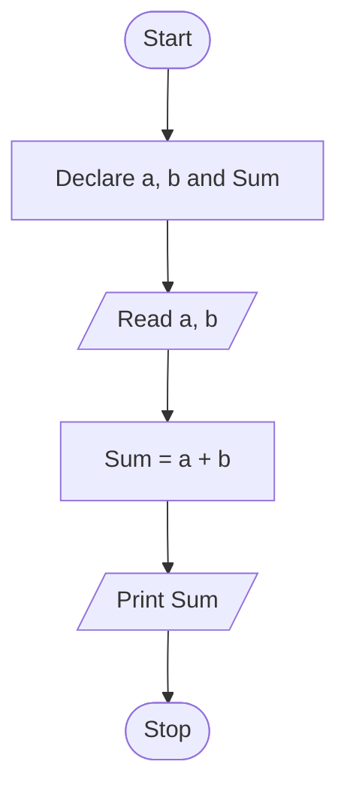

# Q. WHAT is Algorithm

An algorithm is a set of finite number of steps to solve a problem. It takes some **input**, **processes** it through a set of instructions, and produces the required **output**.

Key points about algorithms: they receive input, contain a sequence of statements to solve a problem using given data, and are completely **language independent** — the same algorithm can be implemented in C, C++, Java, or any other language.

---

## Q. Characteristics of an Algorithm

**1. Clear & Unambiguous** — Every step must be precisely and clearly stated with no room for confusion or misunderstanding about what to do.

**2. Well-defined Inputs** — An algorithm must have clearly specified data that is provided *before* the algorithm starts executing.

**3. Well-defined Outputs** — After processing the inputs through a sequence of statements, the algorithm must produce a well-defined output that depends on the input values.

**4. Finiteness** — The algorithm must always terminate after a **finite number of steps**. It should never run infinitely.

**5. Feasible** — The algorithm should be simple and practical, and should not use overly complex operations.

**6. Language Independent** — An algorithm doesn't depend on any specific programming language like C, C++, or Java. It is written in a generalized manner and can be implemented in any language.

---

## Q. Example Algorithm: Find the Largest of Two Numbers

1. Start
2. Read A and B.
3. If A > B, print A.
4. Otherwise, print B.
5. Stop.

**Example:**

- Input: A = 15, B = 8
- Output: 15 is the largest number.

---
## Q. Algorithm to find the area and perimeter of a circle 

Area of circle = ${\pi}r^{2}$ 
Perimeter or circumference = $2{\pi}r$ 

### Algorithm

1. Start
2. Read the radius **r** of the circle.
3. Calculate the area using:
    Area= $\pi\times{r}\times{r}$  
4. Calculate the perimeter (circumference) using:
	$2{\pi}r$ 
5. Display the area and perimeter.
6. Stop.

---
# Q. Algorithm to find the largest of 3 numbers

1. start
2. read number 1, number 2, number 3.
3. if A>B, set LARGE = A, else set LARGE =B
4. if C>LARGE, set LARGE=C
5. Display LARGE as the largest number
6. stop

---
## Q. Time complexity of an algorithm

Time Complexity is the amount of time an algorithm takes to run as a function of the input size (n).

n is the number of steps.
- it helps us to understand how much time an algorithm takes to execute.
- we don't measure time, as a fast computer can execute faster, so its hardware dependent, instead we the count no. of steps of execution.

Notation : O(n) --> n is a number of steps taken

**time complexity examples:**
for sum of two numbers: O(1)  --> simple a+b 
display numbers from 1 to n: O(n)  -> loop runs n times
Nested loop: O($n^{2}$) --> loop inside a loop

---

# Q. Different problem-solving approaches

There are 2 main approaches:
1. top-down
	you start with the big problem, then break it into smaller sub-problems, and keep breaking those down until each piece is simple enough to solve directly.
	EX: to calculate student result, take the total marks directly, then calculate percentages, decide pass or fail.
2. bottom-up
	You start by solving the smallest, simplest parts first, then combine them to build up the full solution.
	EX: same example, but here build small programs like a way to calculate percentage,  total marks, pass threshold logic, etc.. and merge them at last. 

---
## Q. What is flow chat with example 

A flow chart is the graphical/pictorial representation of an algorithm is called a flowchart

| Symbol (Shape)                      | Name                        | Purpose                                    |
| ----------------------------------- | --------------------------- | ------------------------------------------ |
| ⬭                                   | Oval                        | Indicates Start/Stop                       |
| ▱                                   | Parallelogram               | Indicates I/P & O/P                        |
| ▭                                   | Rectangle                   | Used for Processing                        |
| ◇                                   | Diamond Symbol              | Indicates Decision Making                  |
| ↓ → ↑                               | Arrow Symbols               | Indicates flow of execution of statements  |
| Draw the diagram,as in image below. | Onpage Reference            | Continuation of flowchart on the same page |
| Draw the diagram,as in image below. | Off Page Reference          | Continuation of flowchart on another page  |
| Draw the diagram,as in image below. | Double Side Ended Rectangle | Indicates a Subroutine                     |

- Is also know as a plan for algorithm.

- These are the mainly used symbols while we are drwing flowcharts

Now we are going to draw an example flow chart
### Example for flowchart.
Flow chat for sum of two numbers.

---
> extra related question:
1. Discuss algorithm and flowchart together with an example. (just write both from above)
