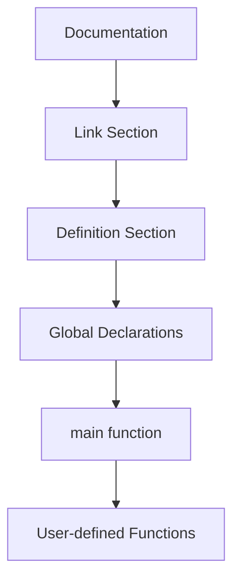

# Q1. Explain Basic Structure of C with example 🌟

The structure of a C program refers to the standard sections used to write a valid program.

## Basic Structure

1. Documentation section
2. Link section
3. Definition section
4. Global declaration section
5. `main()` function
6. User-defined functions

## Example Program

```c
/* Program to display a message */
#include <stdio.h>
#define MSG "Welcome to C"

int value = 10;

int main() {
    printf("%s\n", MSG);
    printf("Value = %d\n", value);
    return 0;
}
```

## Explanation

- Documentation section: comments describing the program.
- Link section: header files like `#include <stdio.h>`.
- Definition section: symbolic constants using `#define`.
- Global declarations: variables or function declarations used across functions.
- `main()`: starting point of execution.
- User-defined functions: additional functions written by the programmer.

## Overview 
dont write in exam, this is for your understiandggskdf



---
# Q2. Explain input and output functions in C (printf / scanf) 🌟

Input and output functions are used to read data from the user and display results on the screen.

these are includue in the library stdio.h
## Common Input/Output Functions

| Function    | Purpose                        |
| ----------- | ------------------------------ |
| `printf()`  | Displays output                |
| `scanf()`   | Reads formatted input          |

## Example Program

```c
#include <stdio.h>

int main() {
    int age;
    char grade;

    printf("Enter age: ");
    scanf("%d", &age);

    printf("Enter grade: ");
    scanf(" %c", &grade);

    printf("Age = %d\n", age);
    printf("Grade = %c\n", grade);
    return 0;
}
```

## Important Point

`scanf()` requires the address of the variable, so `&` is generally used before variable names.

---
# Q3. Explain about different computer languages.

There are 3 main computer languages
1. **MACHINE LANGUAGE**
	Made entirely of 0s and 1s — the only language the CPU directly understands without translation. It's fast but extremely hard for humans to write or debug.
	- its written in only 0's and 1's
	- it is called as `Low level language`
2. **ASSEMBLY LANGUAGE**
	this language replaces 0's and 1's with short keywords like `ADD`, `SUB` and `MOV` making it slightly more readable. 
	- it needs an assembler to convert into a Machine language
	- it is called as also called as `Low level language`
3. **HIGH LEVEL LANGUAGE**
	Languages like C, Python, Java — written in English-like,and are much easier for humans to read and write.
	- They need a compiler and interpreter to convert to machine language and run the code.
	- it is called `High level language`
---
